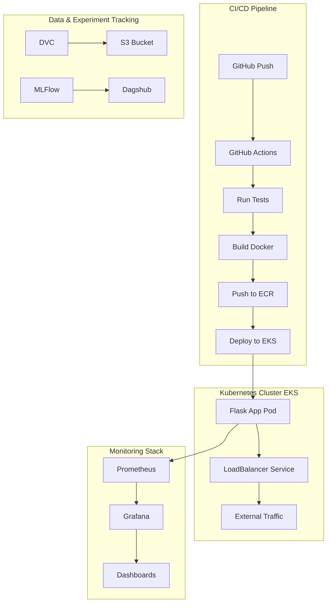

# 🚀 MLOps Capstone Project

<div align="center">

[](https://ml-ops.org/)
[](https://www.python.org/)
[](https://flask.palletsprojects.com/)
[](https://www.docker.com/)
[](https://kubernetes.io/)
[](https://aws.amazon.com/)

**An End-to-End Machine Learning Operations Pipeline with Automated CI/CD, Container Orchestration, and Real-Time Monitoring**

</div>

---

## 📋 Table of Contents

- [✨ Overview](#-overview)
- [🏗️ Architecture](#️-architecture)
- [🛠️ Tech Stack](#️-tech-stack)
- [🚀 Features](#-features)
- [📁 Project Structure](#-project-structure)
- [⚙️ Installation & Setup](#️-installation--setup)
- [🔧 Pipeline Components](#-pipeline-components)
- [🌐 Deployment](#-deployment)
- [📊 Monitoring & Observability](#-monitoring--observability)
- [🤝 Contributing](#-contributing)

---

## ✨ Overview

**Atlas** is a production-grade MLOps pipeline that demonstrates the complete lifecycle of machine learning models - from data ingestion and experimentation to deployment and monitoring. This project showcases industry best practices for automating ML workflows, containerizing applications, orchestrating deployments on Kubernetes, and implementing comprehensive observability.

**Key Highlights:**
- 🔄 **End-to-End ML Pipeline**: From data ingestion to production-ready API
- ☁️ **Cloud-Native Architecture**: Leveraging AWS EKS, S3, and ECR
- 🤖 **Automated CI/CD**: GitHub Actions for seamless deployment
- 📈 **Production-Ready**: Scalable, maintainable, and monitored
- 🐳 **Container Orchestration**: Docker + Kubernetes on EKS
- 📊 **Real-Time Monitoring**: Prometheus & Grafana integration

---

## 🏗️ Architecture



---

## 🛠️ Tech Stack

### **Backend & ML**
*  **Python 3.10** - Core programming language
*  **Flask API** - Web framework for model serving
*  **Pandas & NumPy** - Data manipulation and computation
*  **Scikit-learn** - Machine learning algorithms

### **Data Version Control & Experiment Tracking**
*  **DVC for Data Version Control** - Track datasets and models
*  **MLFlow Experiment Tracking** - Experiment logging and comparison
*  **Dagshub Remote Tracking** - Remote experiment repository

### **Containerization & Orchestration**
*  **Docker Containerization** - Container images and deployment
*  **Kubernetes (EKS)** - Container orchestration platform
*  **eksctl Cluster Management** - AWS EKS cluster provisioning
*  **kubectl CLI** - Kubernetes command-line tool

### **Cloud Services (AWS)**
*  **Amazon EKS** - Fully managed Kubernetes service
*  **AWS S3 Storage** - Scalable object storage
*  **Amazon ECR** - Private Docker image registry
*  **AWS IAM Security** - Identity and access management

### **CI/CD & Automation**
*  **GitHub Actions CI/CD** - Automated workflows and testing
*  **Secrets Management** - Secure credential handling

### **Monitoring & Observability**
*  **Prometheus Metrics Collection** - Time-series metrics database
*  **Grafana Dashboards** - Visualization and monitoring
* **Custom Logging Framework** - Application-level logging
* **Real-time Application Monitoring** - Performance tracking and alerting

---

## 🚀 Features

### 📊 Data Management
* **Data Version Control with DVC** - Track datasets and models versions
* **Automated Data Pipelines** - DVC repro for reproducible workflows
* **S3 Integration** - Scalable remote storage of data artifacts

### 🧪 Experiment Tracking
* **MLFlow Integration with Dagshub** - Experiment logging and comparison
* **Model Registry** - Versioning and promoting models to production
* **Parameter Management** - Centralized params.yaml configuration

### 🔄 CI/CD Pipeline
* **Automated Testing** - Comprehensive tests on every push using GitHub Actions
* **Docker Image Building** - Automatic building and pushing to AWS ECR
* **Zero-Downtime Deployment** - Seamless deployment to EKS cluster
* **Environment Secrets Management** - Secure handling with GitHub Secrets

### ☁️ Cloud Infrastructure
* **AWS EKS Cluster** - Fully managed containerization and orchestration
* **AWS S3 Storage** - Persistent data storage with high availability
* **AWS ECR** - Private Docker image registry for secure image management
* **LoadBalancer Service** - External traffic routing with auto-scaling

### 📈 Monitoring & Observability
* **Prometheus Integration** - Metrics collection and scraping from applications
* **Grafana Dashboards** - Real-time visualization and monitoring
* **Custom Metrics** - Application-level metrics from Flask
* **Alerting Capabilities** - Proactive monitoring and notifications

---

## 📁 Project Structure

\`\`\`
atlas-mlops/
│
├── .github/workflows/
│   └── ci.yaml                 # CI/CD pipeline definition
│
├── flask_app/
│   ├── app.py                  # Flask application entry point
│   ├── requirements.txt        # Python dependencies
│   └── Dockerfile              # Container configuration
│
├── src/
│   ├── __init__.py
│   ├── logger.py               # Logging configuration
│   ├── data_ingestion.py       # Data loading module
│   ├── data_preprocessing.py   # Data cleaning & transformation
│   ├── feature_engineering.py  # Feature creation module
│   ├── model_building.py       # Model training script
│   ├── model_evaluation.py     # Model performance metrics
│   └── register_model.py       # Model version registration
│
├── tests/                      # Unit & integration tests
├── scripts/                    # Utility scripts
├── models/                     # Saved model artifacts
│
├── dvc.yaml                    # DVC pipeline definition
├── params.yaml                 # Hyperparameters configuration
├── requirements.txt            # Core dependencies
├── Dockerfile                  # Root Docker configuration
├── deployment.yaml             # Kubernetes deployment manifest
│
└── README.md                   # Project documentation
\`\`\`

---

## ⚙️ Installation & Setup

### **Prerequisites**
* **Python 3.10+** - Programming language runtime
* **Docker Desktop** - Container environment for local development
* **kubectl** - Kubernetes command-line interface
* **eksctl** - AWS EKS cluster management tool
* **AWS CLI** - Amazon Web Services command-line interface
* **Git** - Version control system
* **Conda/Miniconda** - Python environment manager

### **Local Development Setup**

\`\`\`bash
# Clone repository
git clone https://github.com/Ajs2207/MLOPS-Capstone-Project.git
cd MLOPS-Capstone-Project

# Create virtual environment
conda create -n atlas python=3.10
conda activate atlas

# Install dependencies
pip install -r requirements.txt

# Run locally
cd flask_app
python app.py
\`\`\`

### **DVC Pipeline Execution**

\`\`\`bash
# Initialize DVC
dvc init

# Configure remote storage
dvc remote add -d myremote s3://your-bucket-name

# Run pipeline
dvc repro

# Check status
dvc status
\`\`\`

### **Docker Build & Run**

\`\`\`bash
# Build image
docker build -t capstone-app:latest .

# Run container
docker run -p 8888:5000 -e CAPSTONE_TEST=<your-token> capstone-app:latest
\`\`\`

---

## 🔧 Pipeline Components

| Component | Description | Tools |
|-----------|-------------|-------|
| **Data Ingestion** | Fetches data from source | Python, Pandas |
| **Data Preprocessing** | Cleaning & data transformation | Pandas, NumPy |
| **Feature Engineering** | Creates features for modeling | Scikit-learn |
| **Model Building** | Training & hyperparameter tuning | Scikit-learn |
| **Model Evaluation** | Performance metrics calculation | Scikit-learn, MLFlow |
| **Model Registration** | Version control & storage | MLFlow, DVC |

---

## 🌐 Deployment

### **CI/CD Pipeline Stages**

| Stage | Tools | Purpose |
|-------|-------|---------|
| **Code Commit** | Git, GitHub | Version control & collaboration |
| **Continuous Integration** | GitHub Actions, pytest | Automated testing & validation |
| **Container Build** | Docker, Dockerfile | Image creation & optimization |
| **Registry Push** | AWS ECR, AWS CLI | Private image storage |
| **Continuous Deployment** | kubectl, eksctl | Kubernetes deployment |
| **Health Check** | curl, custom scripts | Deployment verification |

### **Deploy to EKS**

\`\`\`bash
# Create EKS cluster
eksctl create cluster --name flask-app-cluster --region us-east-1 \
  --nodegroup-name flask-app-nodes --node-type t3.small --nodes 1

# Update kubeconfig
aws eks --region us-east-1 update-kubeconfig --name flask-app-cluster

# Deploy application
kubectl apply -f deployment.yaml

# Get LoadBalancer URL
kubectl get svc flask-app-service

# Test the deployment
curl http://<external-ip>:5000
\`\`\`

### **Sample Kubernetes Deployment**

\`\`\`yaml
apiVersion: apps/v1
kind: Deployment
metadata:
  name: flask-app
spec:
  replicas: 2
  selector:
    matchLabels:
      app: flask-app
  template:
    metadata:
      labels:
        app: flask-app
    spec:
      containers:
      - name: flask-app
        image: <aws-account-id>.dkr.ecr.us-east-1.amazonaws.com/capstone-proj:latest
        ports:
        - containerPort: 5000
---
apiVersion: v1
kind: Service
metadata:
  name: flask-app-service
spec:
  type: LoadBalancer
  ports:
    - port: 5000
      targetPort: 5000
  selector:
    app: flask-app
\`\`\`

---

## 📊 Monitoring & Observability

### **Prometheus Configuration**

\`\`\`yaml
# prometheus.yml
global:
  scrape_interval: 15s

scrape_configs:
  - job_name: "flask-app"
    static_configs:
      - targets: ["<load-balancer-dns>:5000"]
\`\`\`

### **Metrics Tracked**

| Metric Type | Description |
|-------------|-------------|
| **Request Latency** | Time taken to process requests |
| **Request Throughput** | Number of requests per second |
| **Model Prediction Time** | Inference latency |
| **Error Rates** | Percentage of failed requests |
| **System Resources** | CPU & Memory utilization |

### **Grafana Setup**

* **Launch EC2 instance** for Grafana (t3.medium, 20GB SSD)
* **Configure security group** to allow port 3000
* **Install Grafana** and add Prometheus as data source
* **Create custom dashboards** for visualization and monitoring

---

## 🤝 Contributing

* **Fork** the repository
* **Create a feature branch** - `git checkout -b feature/amazing-feature`
* **Commit your changes** - `git commit -m 'Add amazing feature'`
* **Push to the branch** - `git push origin feature/amazing-feature`
* **Open** a Pull Request

---

## 📞 Contact

For questions, feedback, or collaboration opportunities:

* **Project Lead:** [Your Name]
* **Email:** your.email@example.com
* **LinkedIn:** linkedin.com/in/your-profile
* **GitHub:** github.com/your-username

---

## 📝 License

This project is for demonstration purposes as part of an MLOps portfolio.

<div align="center">

⭐ Star this repo if you find it useful!

Built with ❤️ for Production ML Systems

</div> ```